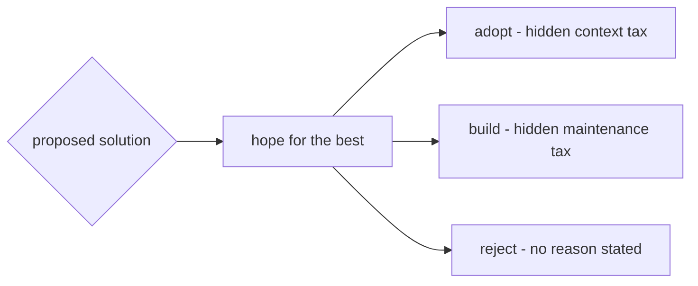
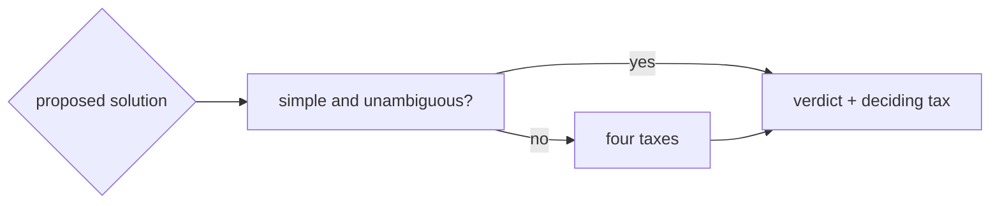

> labels: architecture, unit, dependency, tradeoff

## Usage

> - Usage: Apply `unit__arch__context_tradeoff` skill to a proposed architectural solution.

## Why should I care?

### Before (Without this skill)

| symptom                     | result                             |
|-----------------------------|------------------------------------|
| "it's popular, adopt it"    | context tax discovered later       |
| "I'll just build it myself" | you become the upstream, forever   |
| 3rd party lib adopted       | no project-specific rules written  |
| verdict given               | one side of the ledger never named |

### After (With this skill)

| step                   | what you get                                         |
|------------------------|------------------------------------------------------|
| name the posture       | adopted vs built, stated plainly                     |
| name the four taxes    | context, community, patching, integration            |
| both sides named       | the rejected option's tax is on the record too       |
| integration tax stated | the project-specific rules artifact is not forgotten |
| build-becomes-upstream | building to escape a tax is named as inheriting one  |
| verdict                | adopt / build / reject, with the deciding tax        |
