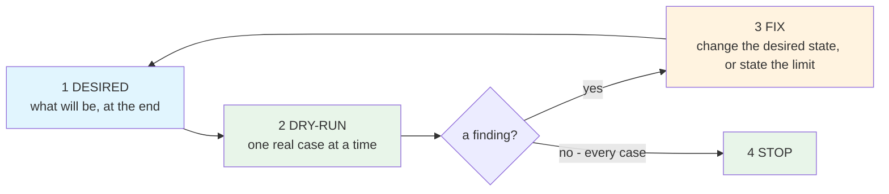

## I/O

| role        | content (file_path/text/tool)                      | example                                                  |
|-------------|----------------------------------------------------|----------------------------------------------------------|
| input1      | the architectural change (text)                    | one skill, many sandboxes, results kept                  |
| input2      | the cases it must work for (file_path)             | the real projects the change will touch                  |
| input3      | the output directory (file_path)                   | any directory, empty or holding an earlier run           |
| processing  | Use `unit__arch__desired_and_dry_run` for input1   |                                                          |
| output1     | `<output dir>/desired__structure.md` (text)        | created - the desired state                              |
| output2     | `<output dir>/<case>/desired__structure.md` (text) | created - one per case, the same state there             |
| output3     | `<output dir>/<case>/dry_run.md` (file_path)       | created - one per case, findings numbered                |
| output4     | the desired structure, revised (text)              | updated version of output1 - findings fixed or accepted  |

# Rule

The document holds the **desired** state. Its name enforces that; a dry run then tests it against
something that exists.

# How

| Phase   | Do                                                                                          | Not                                                                                          |
|---------|---------------------------------------------------------------------------------------------|----------------------------------------------------------------------------------------------|
| desired | the end state: trees, diagrams, tables. Write it as though it already is                    | what changed, or how it works now - the version it would be compared against gets deleted    |
| dry-run | one real project, walked through the desired state end to end. **Read the code, and count** | a hypothetical. "18 rules", "807 lines", "read by six units" are evidence; "workable" is not |
| fix     | a finding changes the desired state, or becomes a limit written into it                     | a finding left unwritten                                                                     |
| re-run  | every case again - a change can break one that passed                                       | assume the passing cases still pass                                                          |
| stop    | when the cases stop producing findings                                                      | when the document reads well                                                                 |

# Rules

- [Document, Named for its content] - `desired__structure.md`. A document called *desired* cannot hold a correction of what was, and it reads as a description rather than a proposal.
- [Cases, The hard ones] - go looking for the case that breaks it: the fan-out, the second writer, the bulk data. A sample chosen for its ease proves nothing.
- [Run it] - where a check exists, run it. Where a question is decidable, run an experiment. A reasoned answer is a guess in better clothes.
- [Findings, Numbered] - one per case, in a file, with the evidence beside it.
- [Output dir] - ask user if this has not been specified
- [Ask, Only what is theirs] - a decision no rule can settle is the caller's. The rest is yours; handing it over moves work rather than sharing it.
- [Document, A working one] - when the change lands it moves into the skills that carry it, and the document is deleted. One kept beside them drifts.

Decisions and WHY are in `_meta/decisions.md` to avoid token cost when using this skill.
