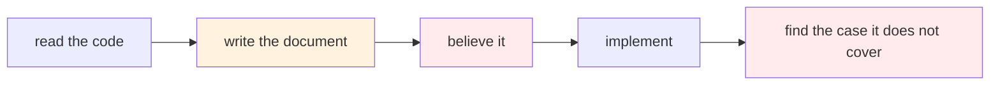
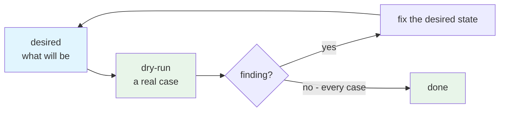

> labels: Harness, Unit, Workflow, Writing

## Usage

> - Usage: Use `unit__arch__desired_and_dry_run` to make an architectural change
> - Benefit: The desired structure is tested before it is believed, so the corrections happen on paper

## Why should I care?

### Before (Without this skill)

A document describes the change, and it reads well. Its problems appear later, in whatever was built from it.

Every fix now costs a rebuild, and the case that breaks it was there to be read the whole time.

### After (With this skill)

The document states the desired end. Each case tests it, and a finding is cheap on paper.

Real findings, from five projects walked through one desired structure:

| The document said | A dry run found |
|---|---|
| a result moves into its consumer's input | one result is read by **six** units, so the second consumer found nothing |
| a unit may write outside its sandbox if it must | the right rule, the wrong exception - and the exception is what let a destination be decided at the wrong layer |
| the check verifies the projects | **17 skills were invisible to it**, and a project renamed but not reworded passed with zero violations |
| a prep step runs once per sandbox | it did not need to - a wire may cross sandboxes, so one run serves five |

| Without | With |
|---|---|
| corrections cost a rebuild | corrections cost an edit |
| the document's coverage is a hope | every rule cites the case that needed it |
| a claim is made once | a claim is tested per case |
| shortcomings surface in production | shortcomings become stated limits |
