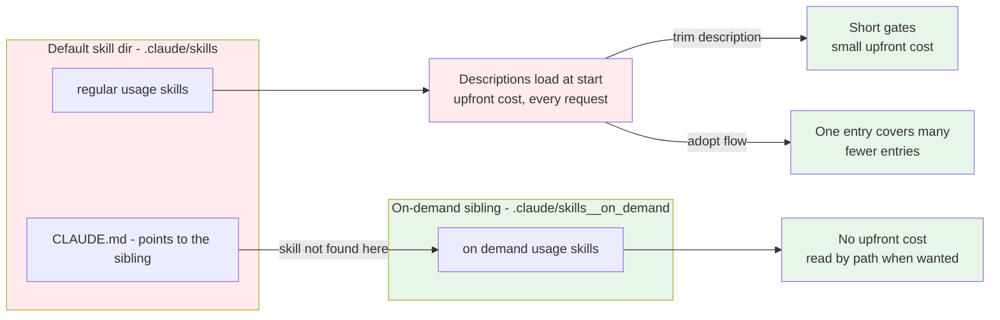

## I/O

| role       | content (file_path/text/tool)                | example                                                                   |
|------------|----------------------------------------------|---------------------------------------------------------------------------|
| input1     | `<project>/.claude/skills/`                  | the default skill dir                                                     |
| processing | Use `unit__context__upfront_cost` for input1 |                                                                           |
| output1    | `<project>/.claude/skills/`                  | updated version of input1 - low-usage skills moved out, `CLAUDE.md` added |
| output2    | `<project>/.claude/skills__on_demand/`       | the low-usage skills                                                      |
| output3    | `<skill>/SKILL.md` description               | shortened to a relevance gate                                             |

# Upfront context cost

Skills in default skill dir == upfront context cost

## Optimisations

| lever             | effect | description                                                                                             | what it cuts                    |
|-------------------|--------|---------------------------------------------------------------------------------------------------------|---------------------------------|
| Adopt `on_demand` | FREE   | Move a low-usage skill to the sibling beside the default dir - it stays reachable by path               | a whole skill stops loading     |
| Trim description  | LEAN   | Shorten each one to a relevance gate, not a summary                                                     | what each remaining skill costs |
| Adopt `flow`      | FEW    | Let a flow skill name its units exactly, where suitable, so their entries drop - e.g. 100 entries to 10 | how many entries remain         |

## Actions

- [IF] a skill is agreed to move to `skills__on_demand`, [THEN] copy `_meta/assets/CLAUDE.md` into the default skill dir to create the references.

## Rules

- [Default dir, High-usage] - Include only high-usage skills in default skill dir.
- [Low-usage, Manual] - Only the user decides which skills are low-usage. The agent never moves a skill on its own.
- [Low-usage, Sibling] - Low-usage skills go in the `skills__on_demand` sibling beside the default skill dir.
- [Description, Gate] - A description is a relevance gate, not a summary. Keep it minimal.
- [Flow] - Flow skills describe when to use which exact `unit` skills, making unit descriptions redundant.
