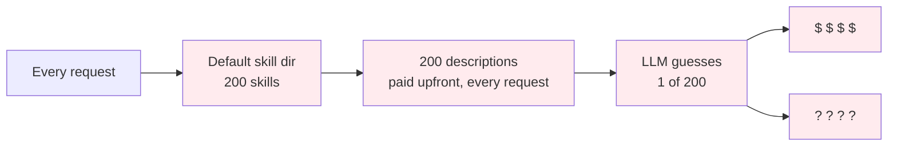
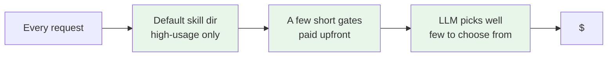

> labels: Harness, Unit, Skill

## Usage

> - Usage: Apply `unit__context__upfront_cost` skill to `xxx` skill
> - Benefit: Avoid harness e.g. claude code to waste a ton of tokens to load skills at start time

## Why should I care?

### Before (Without this skill)

### After (With this skill)

The low-usage skills still exist. They cost nothing until a flow skill names one.
