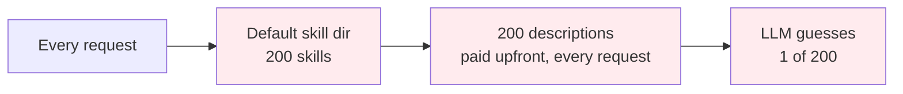
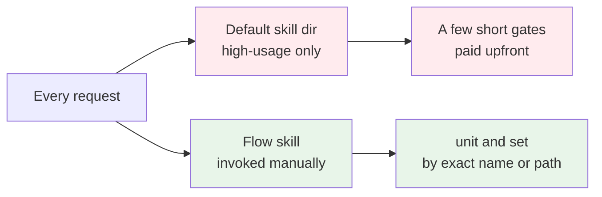

> labels: Harness, Skill

## Usage

> - Usage: Apply `unit__context__upfront_cost` skill to a default skill dir

## Why should I care?

### Before (Without this skill)

### After (With this skill)

The low-usage skills still exist. They cost nothing until a flow skill names one.
