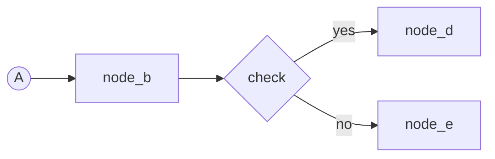

## I/O

| role       | content (file_path/text/tool)             | example                                                           |
|------------|-------------------------------------------|-------------------------------------------------------------------|
| input1     | mermaid flowchart                         | the diagram source                                                |
| tool       | mermaid viewer or parser                  | syntax check - cannot be supplied upfront                         |
| processing | Use `unit__diagram__flowchart` for input1 |                                                                   |
| output1    | mermaid flowchart                         | updated version of input1 - renders, one node or one run per line |

## Source layout

- **No mixing** - Nodes first, then arrows - never both on one line.
- **Nodes** - A node line holds exactly one node definition.
- **Arrows** - Carry bare ids. One run per line.
    - Chain ids while the path does not branch.
    - A branch id ends the run, then begins each branch line.

## Mermaid safety

- [ALWAYS] run a syntax check on the diagram after creating it - render it in a mermaid viewer or run a mermaid parser before the diagram counts as done.
- Never put `;` in a label.
- Never put angle brackets (`<` or `>`) in a node label.
- Use ` ` for line breaks.
- Spell a dash as `-` - an em dash or en dash is not on a keyboard.
- Spell `+` as `plus`.
- Spell `&` as `and`.